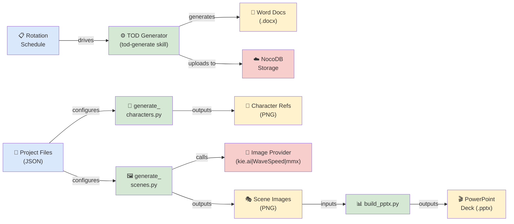
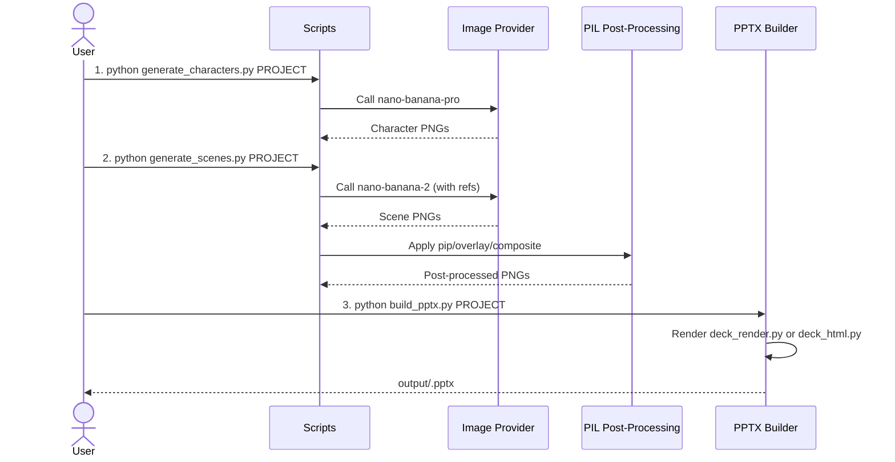

# Children's Weekly Content Pipeline — Project Summary

## Executive Summary

This project is a **dual-track content generation pipeline** for children's Sunday school lessons. It automates two distinct workflows: **(1) TOD (Teaching of the Day)** — generating Word documents with quizzes, presentations, and activity materials weekly; and **(2) Slides** — an AI-powered storybook illustration pipeline that creates 2K PowerPoint decks from hand-authored story and character definitions. The Slides system supports three interchangeable image providers (kie.ai, WaveSpeed, mmx) with cost-optimized generation modes ranging from $0.045–$0.14 per image. Both systems are designed for rapid iteration and cross-project reuse.

---

## Architecture Overview



The project operates as **two independent but mutually supportive systems**:

- **TOD System** — scheduled weekly content generator; reads rotation metadata, produces templated Word documents, uploads to NocoDB for distribution
- **Slides System** — on-demand storybook illustration pipeline; reads project JSON, generates character reference sheets and scene images via AI, assembles into PowerPoint decks

---

## Processing Pipeline

### Slides Pipeline (3-Step Workflow)



**Step 1: Generate Character References**
- Runs `generate_characters.py <project>` once per project
- Calls `nano-banana-pro` in `text-to-image` mode
- Outputs reference PNG for each character (full body, facing forward, plain background)
- Cost: **$0.14 per character** (one-time per project)

**Step 2: Generate Scene Images**
- Runs `generate_scenes.py <project>`
- Each scene has a `mode` and optional reference images
- Calls image provider (default: kie.ai) with the chosen mode and model
- Optional PIL post-processing: picture-in-picture, overlays, composite stitching
- Cost: **$0.045–$0.14 per scene** (depending on mode/model)

**Step 3: Assemble PowerPoint**
- Runs `build_pptx.py <project>`
- Reads `slides.json` to determine slide order and theming
- Uses `deck_render.py` (native PowerPoint shapes, editable text) or `deck_html.py` (screenshot, pixel-perfect)
- Embeds scene PNGs as pictures, assigns themes and CTAs
- Outputs `.pptx` ready for presentation or further editing

---

## Core Components

### 1. **Provider Abstraction Layer** (`slides/_lib/`)

Unified interface to three interchangeable image generation backends:

| File | Provider | Usage | Cost Model | Notes |
|------|----------|-------|-----------|-------|
| `provider.py` | — | Abstraction; selects provider by flag, env, or config | — | Routes all API calls |
| `kie.py` | kie.ai (default) | Per-image credits; job API (wait for completion) | Per-image $ | Handles base64 ref upload automatically |
| `wavespeed.py` | WaveSpeed | Per-image $ charged immediately | Per-image $ | Inline base64 refs; fast turnaround |
| `mmx.py` | mmx CLI (local) | Quota-based (no per-image $) | Quota only | Single `--subject-ref` per call; multi-ref edits need kie/wavespeed |

**Provider Selection** (in order of precedence):
1. `--provider kie|wavespeed|mmx` (CLI flag)
2. `"provider"` field in `project.json`
3. `IMAGE_PROVIDER` environment variable
4. Default: `kie`

### 2. **Generation Scripts** (`slides/_scripts/`)

| Script | Purpose | Input | Output | Models Used |
|--------|---------|-------|--------|------------|
| `generate_characters.py` | Create character refs | `characters.json` | `characters/<id>/reference.png` | `nano-banana-pro` (text-to-image) |
| `generate_scenes.py` | Create scene images | `scenes.json` + character refs | `scenes/<scene-id>/<variant>/output.png` | `nano-banana-pro` (text) or `nano-banana-2` (edit/edit-fast) |
| `build_pptx.py` | Assemble PowerPoint deck | `slides.json` + scene images | `output/<project>.pptx` | — (uses deck_render or deck_html) |
| `build_revision.py` | Utility for revision tracking | — | — | — |

### 3. **Rendering Engines** (`slides/_scripts/deck_*.py`)

**`deck_render.py`** — Native PowerPoint shape assembly:
- Generates editable `.pptx` with real PowerPoint text boxes
- Requires `Caveat` and `Patrick Hand` fonts installed
- Embeds images as JPEG (downscaled to 1600px, q88) for smaller file size (~5–6MB)
- Supports all slide types: title, topic, story-card, diary-card, bible-text, verse, prayer, objectives, etc.

**`deck_html.py`** — HTML-to-screenshot rendering:
- Renders slides to standalone 1920×1080 HTML using Google Fonts
- Embeds images as data URIs
- Uses `playwright-cli` (headless Chromium) to screenshot
- Output: pixel-perfect to design mock but flat images (not editable)
- Requires network for Google Fonts download

### 4. **PIL Post-Processing** (no extra API cost)

Applied locally after scene image download. Configurable per-scene via `pip`, `overlay`, and `composite`:

| Field | Purpose | Cost | Example |
|-------|---------|------|---------|
| `pip` | Picture-in-picture: resize + stamp an earlier scene | Free | `{"source": "scene-1/1c", "position": "center-right", "scale": 0.28, "border": true}` |
| `overlay` | Stamp a graphic asset (stop-sign, tick, X) | Free | `{"asset": "stop-sign", "position": "center", "scale": 0.45, "opacity": 0.88}` |
| `composite` | Stitch multiple existing images into panels | Free | `{"layout": "3-panel-vertical", "sources": [...]}` |

Valid `position` values: `center`, `center-right`, `center-left`, `top-right`, `top-left`, `bottom-right`, `bottom-left`.

---

## API Contracts & Data Schemas

### Scene JSON Schema

```json
{
  "id": "scene-2/2a",
  "title": "Short description of scene",
  "mode": "text-to-image | edit | edit-fast | composite | reuse",
  "model": "nano-banana-pro | nano-banana-2",
  "resolution": "2k",
  "chars": ["character-id-1", "character-id-2"],
  "base_scene": "scene-1/1a",
  "base_project": "other-project",
  "prompt": "Full detailed image generation prompt...",
  "pip": { "source": "scene-1/1c", "position": "center-right", "scale": 0.28, "border": true },
  "overlay": { "asset": "stop-sign", "position": "center", "scale": 0.45, "opacity": 0.88 }
}
```

**Mode Decisions:**

| Scenario | Mode | Model | Reason |
|----------|------|-------|--------|
| New scene, no prior images | `text-to-image` | `nano-banana-pro` | Full creative generation; character described inline |
| Placing established characters into new scene | `edit` | `nano-banana-2` | Pass character refs; model places them; cheaper than pro |
| Minor modification to previous scene | `edit-fast` | `nano-banana-2` | Fastest & cheapest; base on existing image |
| Stitch images side-by-side (no API call) | `composite` | — | Pure PIL; free; use `layout` + `sources` |
| Copy another scene's output unchanged | `reuse` | — | Free; use `source` pointer |

### Characters JSON Schema

```json
[
  {
    "id": "character-id",
    "prompt": "Character reference sheet. [Full physical description: age, clothing, skin tone, hair, distinctive features]. Full body view, standing facing forward. Storybook illustration style, flat digital art, clean outlines, warm vibrant colors. Plain white background."
  }
]
```

- One entry per character
- Always uses `text-to-image` with `nano-banana-pro` at 2K
- Cost: **$0.14 per character** (generated once, reused across all projects via `char_project` config)

### Slides JSON Schema

```json
[
  {
    "id": "scene-1/1a",
    "theme": "Opening Scene",
    "cta": null
  },
  {
    "id": "scene-1/1b",
    "theme": "Main Action",
    "cta": "What happens next?\n\nThe prophet speaks truth."
  }
]
```

- `id` — references a scene ID from `scenes.json`
- `theme` — slide title/label (displayed in the deck)
- `cta` — call-to-action: `null` (image only) or text string (image + white CTA slide after)
- Use `\n\n` for paragraph breaks in CTA

---

## Infrastructure & Deployment

### Image Providers

All three providers sit behind the same `provider.py` interface:

**kie.ai** (default)
- API: Job-based (submit, poll for completion)
- Auth: Bearer token via `KIE_API_KEY` env var
- Reference images: Auto-uploaded to temporary URL before use
- Models: `nano-banana-pro`, `nano-banana-2`
- Cost: Per-image credits

**WaveSpeed** (opt-in)
- API: Direct request-response
- Auth: Bearer token via `WAVESPEEDAI_API_KEY` env var
- Reference images: Inline base64
- Models: `nano-banana-pro`, `nano-banana-2`
- Cost: Per-image $

**mmx** (opt-in, quota-based)
- API: Local CLI (`mmx auth login`, `mmx generate`)
- No API key required; uses local quota
- Reference images: Single `--subject-ref` per call
- Model: `image-01` (auto-mapped from `nano-banana-2` in scripts)
- Cost: Quota only (no per-image $)

### TOD System (NocoDB Integration)

- **Input**: `rotation.json` (weekly schedule metadata)
- **Output**: Word documents uploaded to NocoDB storage
- **Skill**: `tod-generate` (invoked via CLI or scheduled Friday routine)
- **Distribution**: Telegram notification with download links

### Environment Configuration

```bash
# .env file (at project root)
KIE_API_KEY=your_kie_api_key
WAVESPEEDAI_API_KEY=your_wavespeed_key        # Optional if using WaveSpeed
IMAGE_PROVIDER=kie                             # Default: kie
NOCODB_API_URL=https://your.nocodb.instance
NOCODB_API_TOKEN=your_nocodb_token
TELEGRAM_BOT_TOKEN=your_telegram_token
TELEGRAM_CHAT_ID=your_chat_id
```

### Pricing Summary (2K Resolution)

| Mode | Model | Cost |
|------|-------|------|
| `text-to-image` | nano-banana-pro | $0.14 |
| `edit` | nano-banana-pro | $0.14 |
| `edit-ultra` | nano-banana-pro | $0.15 |
| `edit` | nano-banana-2 | $0.105 |
| `edit-fast` | nano-banana-2 | $0.045 |
| `composite` / `reuse` / `pip` / `overlay` | — | $0.00 |

**Rule of thumb:** A 12-scene deck with 5 characters costs **$1.50–$2.00 total** (character refs + mix of edit/edit-fast scenes).

---

## Extension Patterns

### Creating a New Slides Project

#### Step 1: Scaffold Directories

```bash
PROJECT=my-new-topic
mkdir -p slides/projects/$PROJECT/characters
mkdir -p slides/projects/$PROJECT/scenes
mkdir -p slides/projects/$PROJECT/output
```

#### Step 2: Define `characters.json`

```bash
# slides/projects/my-new-topic/characters.json
[
  {
    "id": "angela",
    "prompt": "Character reference sheet. Angela, age 12, African girl with warm brown skin, natural hair in braids with colorful beads, wearing a bright yellow dress and red cardigan. Full body, standing facing forward. Storybook illustration style, flat digital art, clean outlines, warm vibrant colors. Plain white background."
  }
]
```

#### Step 3: Generate Character References

```bash
python3 slides/_scripts/generate_characters.py my-new-topic
```

#### Step 4: Define `scenes.json`

```bash
# slides/projects/my-new-topic/scenes.json
[
  {
    "id": "scene-1/1a",
    "title": "Angela meets the prophet",
    "mode": "edit",
    "model": "nano-banana-2",
    "resolution": "2k",
    "chars": ["angela"],
    "prompt": "Angela (age 12, African girl, braids with beads, yellow dress) stands in a marketplace, looking surprised as a prophet figure approaches. Warm, storybook illustration style..."
  }
]
```

#### Step 5: Generate Scene Images

```bash
python3 slides/_scripts/generate_scenes.py my-new-topic
```

#### Step 6: Define `slides.json`

```bash
# slides/projects/my-new-topic/slides.json
[
  {
    "id": "scene-1/1a",
    "theme": "Meeting the Prophet",
    "cta": null
  }
]
```

#### Step 7: Build PowerPoint

```bash
python3 slides/_scripts/build_pptx.py my-new-topic
```

Output: `slides/projects/my-new-topic/output/my-new-topic.pptx`

### Cross-Project Character Reuse

Set `char_project` in `project.json` to inherit characters from another project:

```json
// slides/projects/my-new-topic/project.json
{
  "name": "My New Topic",
  "char_project": "deliverance"
}
```

Characters not found in the current project are resolved from `slides/projects/deliverance/characters/` automatically.

### Custom PPTX Output

```bash
# Generate with custom filename
python3 slides/_scripts/build_pptx.py my-new-topic --out "MyCustom_Deck_v2.pptx"

# Use screenshot rendering instead of native
python3 slides/_scripts/build_pptx.py my-new-topic --screenshot
```

### Regenerate Specific Scenes

```bash
# After tweaking prompts, regenerate only those scenes
python3 slides/_scripts/generate_scenes.py my-new-topic --redo scene-1/1a scene-2/2b

# Generate only specific scenes (no --redo flag)
python3 slides/_scripts/generate_scenes.py my-new-topic scene-1/1a scene-1/1b
```

---

## Rules & Anti-Patterns

### Do's ✓

- ✓ **Always read character references before writing scene prompts.** Use exact costume descriptions from `characters.json` to avoid mismatched images.
- ✓ **Chain sequential scenes via `base_scene`.** Use `base_scene` pointers to maintain consistent location, lighting, and crowd across slides.
- ✓ **Check image provider balance before generation runs.** Know your quota or credit status upfront.
- ✓ **Sample 2–3 representative scenes after major prompt changes.** Verify output quality before committing to a full run.
- ✓ **Use `edit` mode with character refs for calm/positive scenes.** Cheaper than `text-to-image` and ensures character consistency.
- ✓ **Use `text-to-image` (no character refs) for fear/conflict scenes.** Describe characters inline to avoid safety filter triggers.
- ✓ **Optimize with `pip` and `overlay` to extend imagery.** Free post-processing; no API cost.
- ✓ **Document scene dependencies in a `plan.md`.** Helps team understand character arcs and scene flow.

### Don'ts ✗

- ✗ **Don't describe characters inline in edit-mode prompts.** Pass refs via `chars[]`; model already has the reference image.
- ✗ **Don't generate scenes without reading the character definitions first.** Hallucinated costumes cost the same as correct ones.
- ✗ **Don't mix cross-project character IDs without setting `char_project`.** Scene generation will fail if references aren't resolved.
- ✗ **Don't use `edit-fast` on the first scene in a sequence.** No base image exists; must use `text-to-image` or `edit`.
- ✗ **Don't forget to update `slides.json` after adding scenes.** Scenes not listed won't appear in the final deck.
- ✗ **Don't commit API credentials to version control.** Use `.env` file with `.gitignore` entry.

### Content Filter Rules

- **Child ref + distress prompt** → safety filter triggers. **Solution:** use `text-to-image` (no refs), describe child inline.
- **Calm/positive scenes with child refs** → OK in `edit` mode.
- **Dialogue in images** → only for key teaching moments (speech bubble ≤6 words, "neat cartoon lettering"), never on every slide.

---

## Dependencies

### Python Packages

| Package | Version | Purpose |
|---------|---------|---------|
| `requests` | latest | HTTP client for API calls |
| `python-pptx` | latest | PowerPoint deck generation |
| `Pillow` | latest | Image post-processing (PIL) |
| `python-dotenv` | latest | Environment variable loading |

### System Requirements

- Python 3.14+
- `.env` file at project root with API credentials
- Optional: `playwright-cli` + Chromium for screenshot rendering
- Optional: `mmx` CLI installed + authenticated for mmx provider

### External APIs

| Service | Purpose | Endpoint | Auth |
|---------|---------|----------|------|
| kie.ai | Image generation (default) | `https://api.kie.ai/` | Bearer token |
| WaveSpeed | Image generation (opt-in) | `https://api.wavespeed.ai/` | Bearer token |
| mmx | Image generation (local, opt-in) | CLI only | Local auth |
| NocoDB | Content storage/delivery | Configured via env | Bearer token |

---

## Code Structure

```
.
├── CLAUDE.md                         # AI guidance document
├── README.md                         # (missing; typically at root)
├── config/                           # Configuration files
├── content/
│   ├── teens/                        # TOD content for ages 13-19
│   └── preteens/                     # TOD content for ages 9-12
├── slides/
│   ├── _lib/                         # Provider abstraction + API clients
│   │   ├── provider.py               # Route to kie/wavespeed/mmx
│   │   ├── kie.py                    # kie.ai API client
│   │   ├── wavespeed.py              # WaveSpeed API client
│   │   └── mmx.py                    # mmx CLI wrapper
│   ├── _scripts/                     # Generation workflow
│   │   ├── generate_characters.py    # Step 1: character refs
│   │   ├── generate_scenes.py        # Step 2: scene images
│   │   ├── build_pptx.py             # Step 3: assemble deck
│   │   ├── build_revision.py         # Revision tracking utility
│   │   ├── deck_render.py            # Native PowerPoint renderer
│   │   └── deck_html.py              # HTML screenshot renderer
│   ├── _templates/                   # Prompt templates & brief template
│   │   ├── character-prompt.md       # Style guide for character prompts
│   │   ├── scene-prompt.md           # Style guide for scene prompts
│   │   └── brief-template.md         # Story brief intake form
│   ├── _assets/                      # Graphic overlays (stop-sign, tick, etc.)
│   ├── projects/
│   │   └── <project-slug>/           # One folder per project
│   │       ├── plan.md               # Human-readable story plan
│   │       ├── characters.json       # Character definitions
│   │       ├── scenes.json           # Scene prompts & configs
│   │       ├── slides.json           # Slide order & theming
│   │       ├── project.json          # (optional) char_project config
│   │       ├── characters/           # Generated character PNGs
│   │       ├── scenes/               # Generated scene PNGs
│   │       └── output/               # Final .pptx decks
│   └── README.md                     # Slides system documentation
├── templates/                        # (purpose TBD; may be for TOD)
├── videos/                           # (purpose TBD; may be archive)
└── docs/                             # (Generated documentation)
    ├── project-summary.md            # This file in Markdown form
    ├── project-summary.docx          # Word export with diagrams
    └── diagrams/
        ├── high-level-architecture.drawio     # Editable diagram
        ├── slides-pipeline.drawio             # Editable diagram
        ├── components.drawio                  # Editable diagram
        └── *.drawio.png                       # Rendered PNGs
```

---

## How to Navigate This Project

1. **I want to create a new lesson deck** → Follow the Extension Patterns section (Step 1–7). Start with `characters.json`.
2. **I want to understand the image generation pipeline** → Read the Processing Pipeline section and review `slides/_lib/provider.py`.
3. **I want to extend character reuse across projects** → Set `char_project` in `project.json` (see CLAUDE.md).
4. **I want to tweak PPTX rendering** → Edit `deck_render.py` (native) or `deck_html.py` (screenshot mode).
5. **I want to add a new image provider** → Duplicate `kie.py`, implement the provider interface, update `provider.py`.
6. **I want to generate weekly TOD content** → Use the `tod-generate` skill or see TOD System section in CLAUDE.md.

---

## Next Steps & Open Questions

- **README.md at project root** — Consider creating a top-level README to welcome new contributors.
- **TOD System documentation** — Expand the TOD section with more detail on rotation.json, NocoDB integration, and Telegram notifications.
- **Video content** — The `/videos` folder exists but is undocumented; clarify its role.
- **Revision tracking** — `build_revision.py` exists but is not mentioned in the main pipeline; document its purpose.
- **Cost tracking** — Consider adding a cost-tracking utility to `_scripts/` to audit spending per project.

---

**Generated:** July 26, 2026  
**Repository:** autom8or-com/children-weekly-content  
**Version:** 1.0
